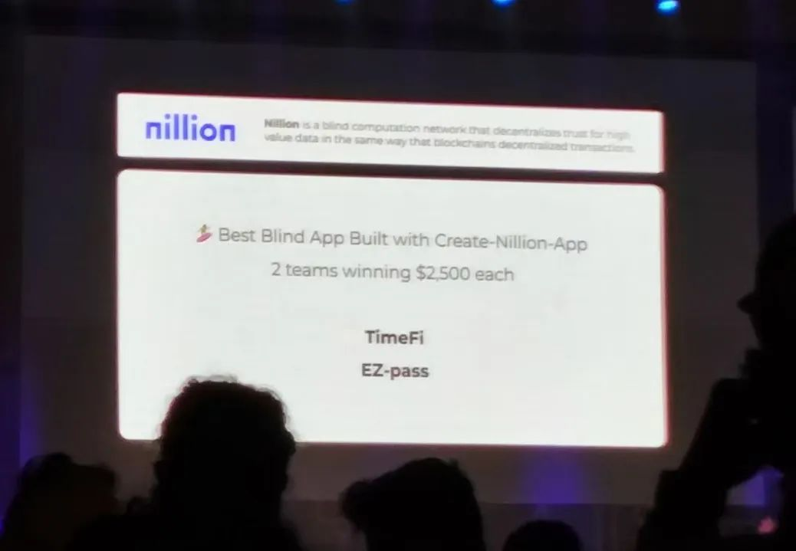

# ETH global hackthon for Bankok 2024(Best Blind App built with Create-Nillion-App: $2,500 )

We will create four branches here:

+ Main branch: with README file
+ dev_js branch: frontend | telegram app code
+ dev_go branch: for golang backend trading platform development.
+ dev_py branch: for AI agent backend development.

# Cowork

For now we connect each branch with api service.

Golang based on Gin, and Python based on FastAPI.

#### What is TimeFi.

TimeFi is **a trust-driven transaction platform that enables free products for buyers and time-value earnings for merchants**.

The core idea behind **TimeFi** is that users lend a certain amount of coins to merchants for a period of time to purchase their goods. Once the lending period expires, the merchants return the borrowed coins to the users. Essentially, users receive the interest from the loan in advance and use it to buy goods, while merchants exchange their goods for temporary ownership of the coins.

This concept is both innovative and versatile, with significant potential in various scenarios.

On the one hand, **TimeFi is particularly well-suited for small and medium-sized businesses or startups seeking funding**. For example, imagine Alice runs a small flower shop and wants to expand her business. However, bank loans often require complex credit evaluations, lengthy procedures, and come with high interest rates. In such cases, TimeFi would be a more suitable alternative. Alice’s customers can choose to pay via TimeFi, effectively helping her raise funds, and in return, Alice can offer them mutually agreed-upon products, like a bouquet of flowers. Through TimeFi, Alice can secure substantial, negotiable-interest loans over a short period, with the flexibility of repaying the interest in the form of goods. Isn’t that amazing? If I were Alice, I’d be thrilled to use such a model to gradually scale up my shop without the burden of high bank interest rates and tedious processes.

On the other hand, **TimeFi is inherently a trust-based payment method that transforms borrowing into a form of transaction**, placing a strong emphasis on mutual trust among users. This trust motivates users to adopt TimeFi for payments, and in turn, using TimeFi strengthens their trust in each other. This virtuous cycle not only encourages more users to join the TimeFi community but also fosters a more harmonious and friendly ecosystem.

Our core application is a Telegram Mini App that bridges merchants and regular consumers. Users can connect their wallets, view their data, and perform both standard and PayFi transactions through this Telegram interface. The TG frontend interacts with the backend, which retrieves user and historical data by querying both the database and blockchain smart contracts. For executing transactions, the TG frontend directly communicates with the smart contracts. In addition to these fundamental capabilities, we have developed a credit system powered by an AI agent. The AI agent processes user transaction history to generate credit scores, which are then relayed to the backend for storage and also written into the smart contract, ultimately determining the borrowing limit available to merchants.

#### You can follow other readme in different folders to know how to run this project

