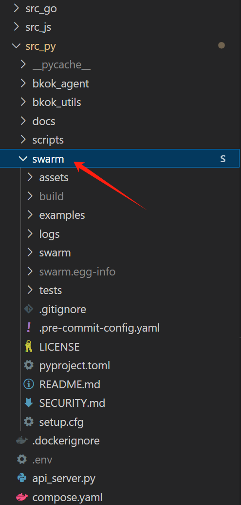

# Python backend

Based on:

+ `FastAPI`: for backend serving
+ `OpenAI`: for general LLM usage, almost every llm supplier has their own OpenAI API service. So we adopt this general setup.
+ Etherscan API: for getting the latest block number and transaction status. (Through simple API calls, requests)
+ `Web3.py`: for wei conversion and interacting with the blockchain.
+ `swarm`: lightweight AI agent creater & framework, created by OpenAI.
+ `dstack-sdk`: the python sdk for dstack - the Phala Network's TEE RA generator.

# Setup

### 1. git clone, with the submodule: swarm

```bash
git clone --recurse-submodules https://github.com/lanigon/timefi.git
cd timefi/src_py
```

or you can use:

```bash
git clone https://github.com/lanigon/timefi.git
cd timefi
git submodule update --init --recursive
```

Now there should be a `swarm` directory in the `src_py` directory, which is the 3-rd party AI framework, developed by OpenAI.

Like this:



Then install the Python packages:

```bash
cd src_py
pip install -r requirements.txt

# then, install swarm:

cd src_py/swarm
pip install .
```

Then install the Nillion SDK:

```bash
curl https://nilup.nilogy.xyz/install.sh | bash
```

If done, open another terminal, and use:

```bash
nilup -V
nillion -V
```

To see whether the installation is successful. You will see:

```bash
nilup 86bb6bd5262c9a223f0895670bba2bfe37ca02ef
tools-config 86bb6bd5262c9a223f0895670bba2bfe37ca02ef
```

**Very Important Notice:**

> `GLIB_C_2.34` or above is required, or you will fail to launch `nillion-devnet`.


### 2. Create a `.env` file
The very first thing you need to do is to create a `.env` file in the `src_py` directory. 

Because the `api_server.py` will first read the environment variables from the `.env` file.

> **The `.env` file configures the llm api provider you want to use, if not set, we will use GLM-4-Flash (FREE) by default.**

The content of the `.env` file should be:
+ `OPENAI_API_KEY`: your OpenAI API key
+ `OPENAI_MODEL_NAME`: the name of the model you want to use
+ `OPENAI_BASE_URL`: the base URL of the OpenAI API service
+ `ETHERSCAN_API_KEY`: your Etherscan API key, used to get the transaction status of target wallet address. **If not provided, the program will not work.**

For example, if we want to use GLM-4-Flash LLM, we should set the `.env` file as:

```bash
OPENAI_API_KEY="your_api_key_here"
OPENAI_MODEL_NAME="glm-4-flash"
OPENAI_BASE_URL="https://open.bigmodel.cn/api/paas/v4/"     # remember to change this to your own OpenAI API service URL.
ETHERSCAN_API_KEY="your_api_key_here"
```

### 3. Compile Nada computing program

Nada is a tool developed by Nillion, for more refer to [this link](https://docs.nillion.com/python-quickstart#write-your-first-nada-program)

### 4. Launch the Nada spinning net

```bash
screen -S nada_net
nillion-devnet
```

Then press `Ctrl+A+D` to exit the screen session.

### 5. Launch the API server

```bash
cd src_py
uvicorn api_server:app --host 0.0.0.0 --port 3008
```


# How to evaluate the wallet credit and base_number?

We have designed a pipeline for this:

